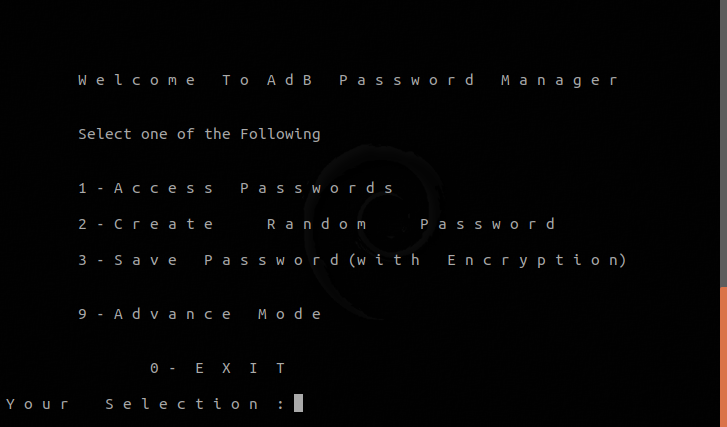

# AdBPassMgr
Password Managing tool which encrypts and decrypts the passwords into a binary file with pin. This tool can generate passwords on the preferences of an individual.

## How to Use: 
        Step 1 : Download or Clone from : https://github.com/akashdeepb/AdBPassMgr.git into your preferred directory
        Step 2 : You'll find a shell script (AdBPassMgr.sh). 
                  [ In Terminal ] 
                  $ chmod +x AdBPassMgr.sh
                  $ ./AdBPassMgr.sh
   
    
    You can change the name of Shell Script to whatever you prefer and run it by 
                  $ ./<shell script name>.sh
            as it will not affect the operation of tool.
